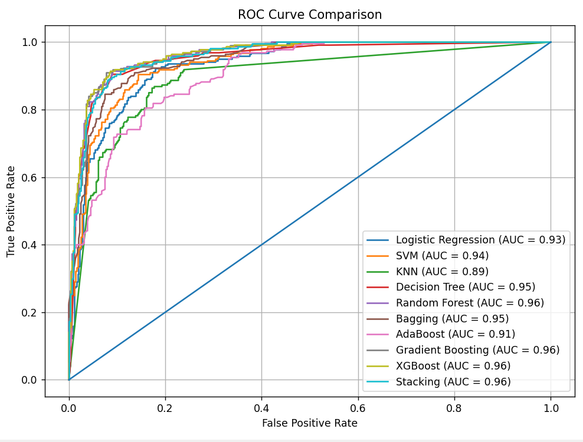
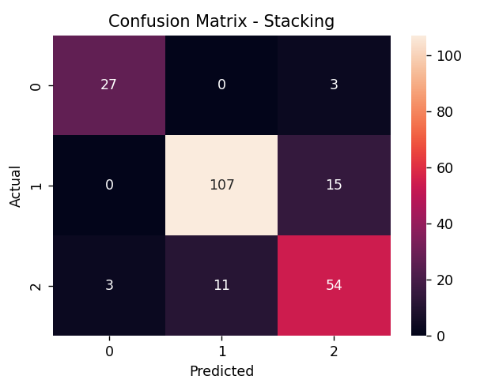

# Suicide Risk Level Prediction (ML Project)

##  Project Overview
This project predicts suicide risk level using psychological and demographic features through Machine Learning models. The goal is to identify individuals at risk and support early intervention.

---

##  Dataset
Source: Kaggle

### Features:
- Depression Level
- Anxiety Level
- Stress Level
- Self Harm History
- Mental Support
- Family Problem
- Relationship Condition
- Age
- Gender
- Academic Performance
- Health Condition

###  Target Variable:
- Suicide Attempt (Risk Level)

---

##  Exploratory Data Analysis (EDA)
- Missing value handling
- Correlation heatmap
- Feature importance analysis
- Class distribution check

---

##  Machine Learning Models Used

### Base Models
- Logistic Regression
- Support Vector Machine (SVM)
- K-Nearest Neighbors (KNN)
- Decision Tree

### Advanced / Ensemble Models
- Random Forest
- Bagging
- AdaBoost
- Gradient Boosting
- XGBoost
- Stacking

---

##  Evaluation Metrics

- Accuracy
- Confusion Matrix
- ROC-AUC Curve
- Classification Report

---

##  Results

- Multiple models were compared using Accuracy and ROC-AUC.
- Ensemble models improved prediction performance.
- Best model selected based on final evaluation metrics.

---

##  Technologies Used

- Python
- Pandas
- NumPy
- Matplotlib
- Seaborn
- Scikit-learn
- XGBoost

---

## 👥 Team Members

- Chanchal Sharma
- Rohit Kumar Yadav
- Vidusha Pareek

---

## 📊 Model Comparison Graph

## 📈 ROC Curve

## ◻️ Confusion Matrices (Model-wise)

### 📌 Logistic Regression

### 📌 Support Vector Machine (SVM)

### 📌 K-Nearest Neighbors (KNN)

### 📌 Decision Tree

### 📌 Random Forest

### 📌 Bagging

### 📌 AdaBoost

### 📌 Gradient Boosting

### 📌 XGBoost

### 📌 Stacking

