# Suicide Risk Level Prediction (ML Project)

## 📌 Project Overview
This project predicts suicide risk level using psychological and demographic features through Machine Learning models. The goal is to identify individuals at risk and support early intervention.

---

## 📊 Dataset
Source: Kaggle  

### Features:
- Depression Level  
- Anxiety Level  
- Stress Level  
- Self Harm History  
- Mental Support  
- Family Problem  
- Relationship Condition  
- Age  
- Gender  
- Academic Performance  
- Health Condition  

### 🎯 Target Variable:
- Suicide Attempt (Risk Level)

---

## 🔍 Exploratory Data Analysis (EDA)
- Missing value handling  
- Correlation heatmap  
- Feature importance analysis  
- Class distribution check  

---

## 🤖 Machine Learning Models Used

- Logistic Regression (Baseline Model)  
- Support Vector Machine (SVM - RBF Kernel) ⭐ Best Model  
- K-Nearest Neighbors (KNN)  
- Decision Tree  

---

## 📈 Evaluation Metrics

- Accuracy  
- Confusion Matrix  
- ROC-AUC Curve  
- Classification Report  

---

## 🏆 Results

- SVM achieved the best performance among all models  
- Model comparison done using accuracy and ROC-AUC  

---

## 🛠️ Technologies Used

- Python  
- Pandas  
- NumPy  
- Matplotlib  
- Seaborn  
- Scikit-learn  

---

## 👥 Team Members

- Chanchal Sharma  
- Rohit Kumar Yadav  
- Vidusha Pareek  

## 📊 Model Comparison Graph
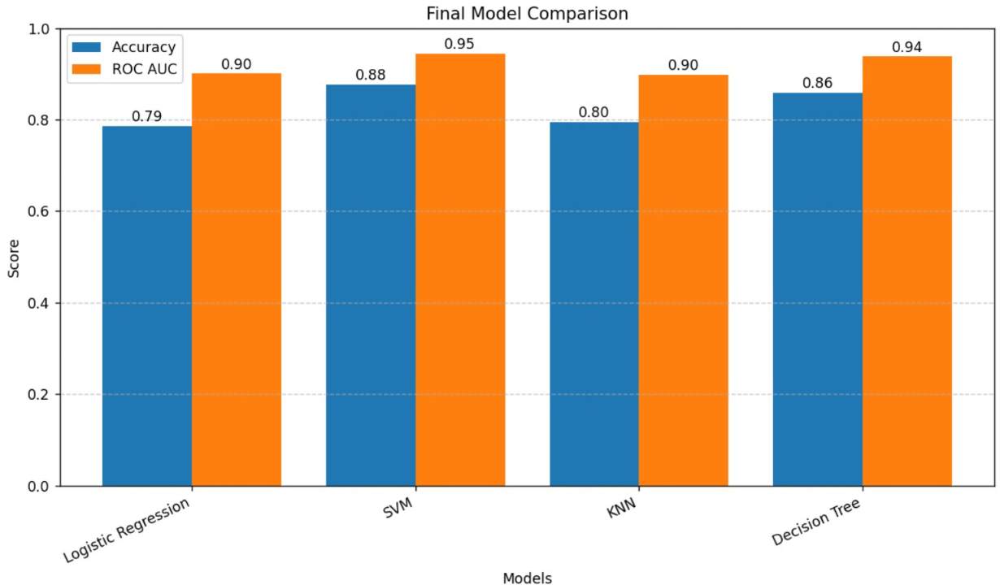

## 📈 ROC Curve
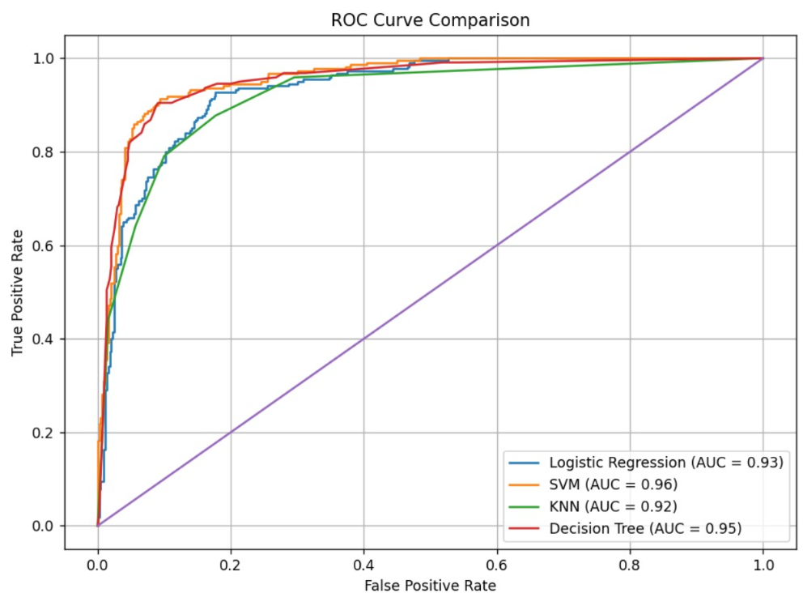

## ◻️ Confusion Matrices (Model-wise)

### 📌 Logistic Regression
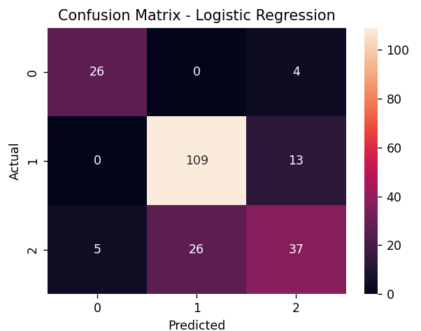

### 📌 Support Vector Machine (SVM)

### 📌 K-Nearest Neighbors (KNN)
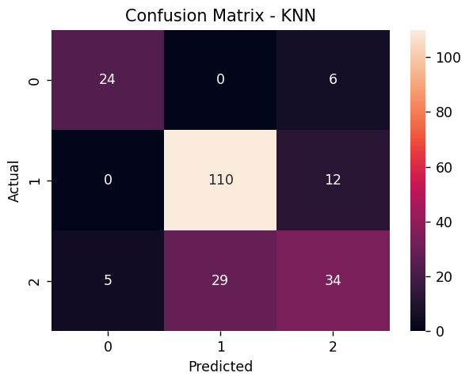

### 📌 Decision Tree
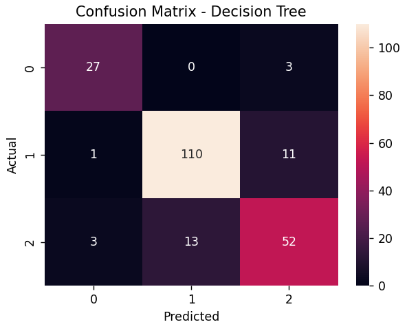

### 📌 Random Forest
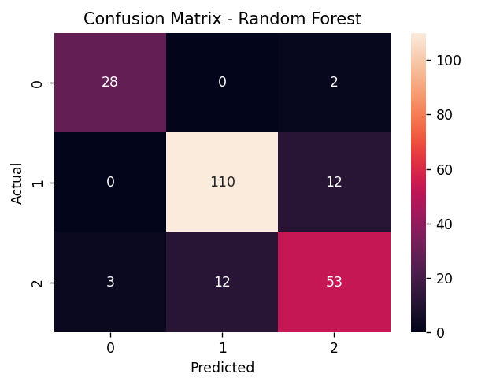

### 📌 Bagging
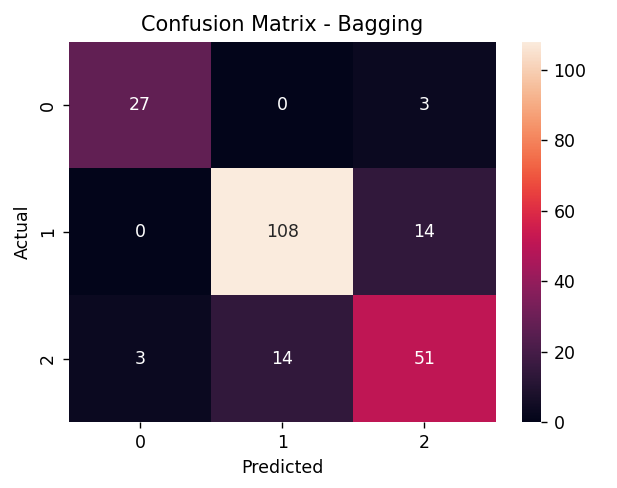

### 📌 AdaBoost
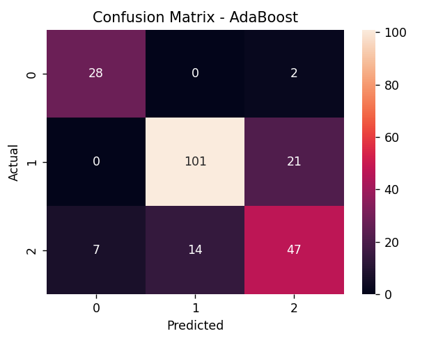

### 📌 Gradient Boosting
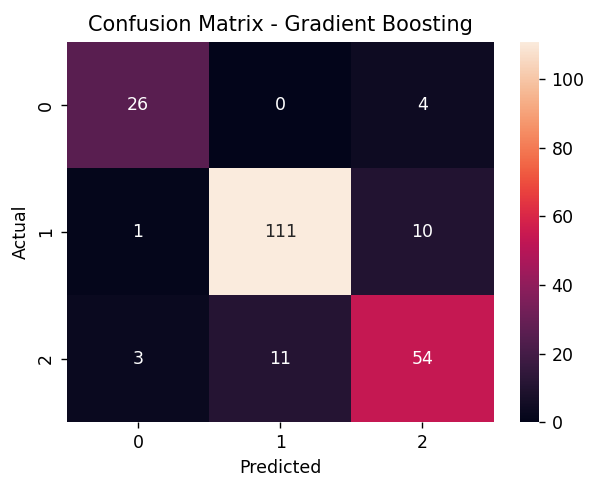

### 📌 XGBoost
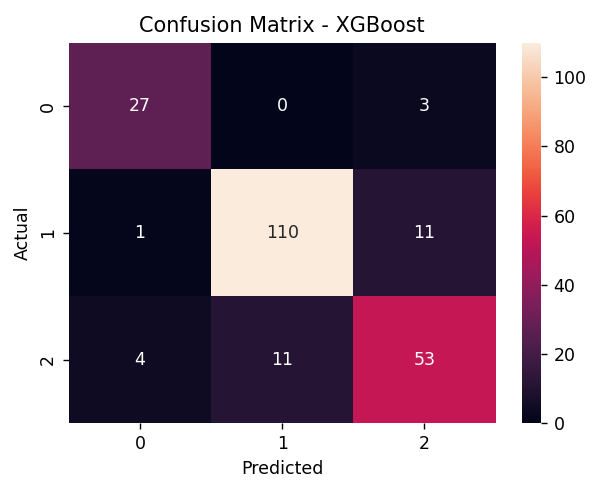

### 📌 Stacking

## ⭐ Feature Importance

## 🏆 Final Best Model
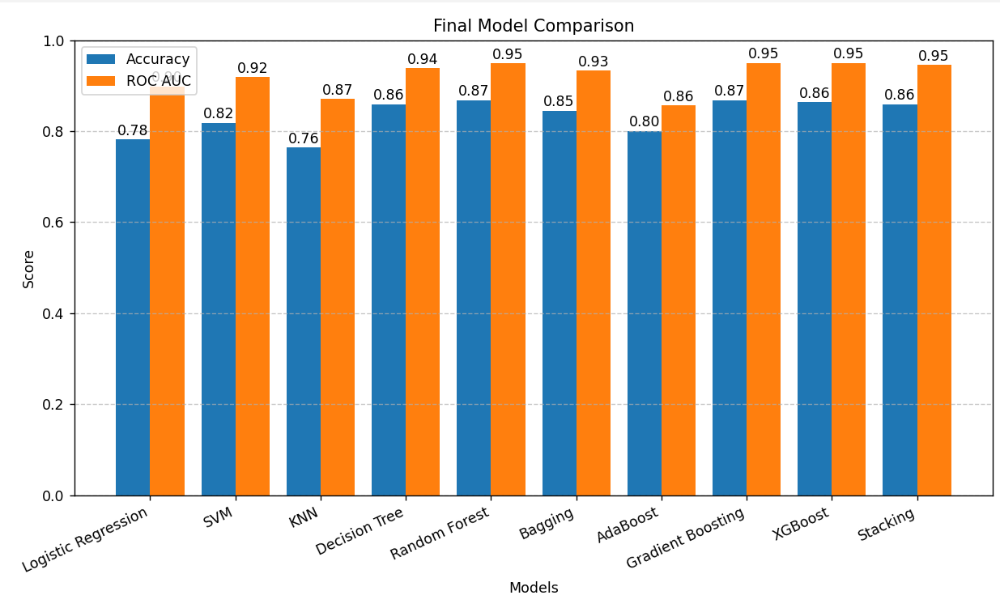
